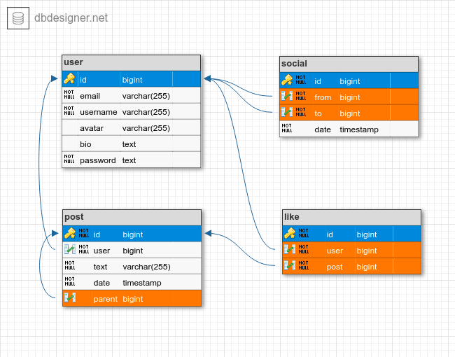

[](https://codecov.io/gh/marcelolleivas/pamps-social-media)


# Pamps
Simple social media and social networking service. Based on [fastapi-workshop](https://github.com/rochacbruno/fastapi-workshop).

- [Quick start](#quickstart)
- [Data Structure](#data-structure)
- [Functionalities](#functionalities)
- [Files and Folders Structures](#files-and-folders-structures)
- [Tests and Test Coverage](#tests-and-test-coverage)

## Quickstart
You must create a virtual env and install the project dependencies. 
**Python 3.8 or greater required**.

### Installation
```commandline
python -m venv .venv
```

Activate the `.venv` created

```commandline
source .venv/bin/activate
```

Install the dependencies
```commandline
pip install --upgrade pip
pip install -r requirements-dev.txt
```

### Setting up Git Hooks
Create `.githook` directory at the root level of your project repository.

```bash
mkdir .githooks
```

Inside the `.githooks` directory, create a file named `pre-commit`. 
You can use a text editor of your choice to create this file or run the command:

```bash
touch .githooks/pre-commit
```

The recommended script you should insert on it is [this](docs/script_content).

You must make `.githooks/pre-commit` script executable by running the following command within the repository directory
```bash
chmod +x .githooks/pre-commit
```

Set up Git to use the local hooks by running the following command within the repository directory:
```bash
git config --local core.hooksPath .githooks
```

With these steps completed, you will have the pre-commit hook set up in your local repository and when you 
are commiting new changes the script will run.


## Data Structure


## Functionalities
### Users
- Register new users;
- Authenticate users;
- Follow other users;
- Unfollow other users;

### Posts
- Create new post;
- Edit post;
- Remove post;
- List following posts;
- Like posts;
- Unlike posts;
- Reply posts.

## Files and Folders Structures
```
.
├── Dockerfile.dev
├── MANIFEST.in
├── Makefile
├── README.md
├── alembic.ini
├── docker-compose.yaml
├── requirements-dev.txt
├── requirements.in
├── requirements.txt
├── settings.toml
├── setup.py
├── test.sh
├── migrations
│   ├── README
│   ├── env.py
│   └── versions
│       └── ...
├── pamps
│   ├── __init__.py
│   ├── app.py
│   ├── auth.py
│   ├── cli.py
│   ├── config.py
│   ├── db.py
│   ├── default.toml
│   ├── security.py
│   ├── models
│   │   ├── __init__.py
│   │   ├── post.py
│   │   └── user.py
│   │
│   └── routes
│       ├── __init__.py
│       ├── auth.py
│       ├── post.py
│       └── user.py
│       
├── postgres
│   ├── Dockerfile
│   └── create-databases.sh
└── tests
    ├── __init__.py
    ├── conftest.py
    └── test_api.py
```

## Tests and Test Coverage
The script `test.sh` runs the tests and prints on console how much of 
the code is coverage and which line of each file is not covered.

You can make similar thing using a `make command`

```bash
make tests-with-coverage
```
The difference is the make command is cleaning all the tests artifacts 
created.
